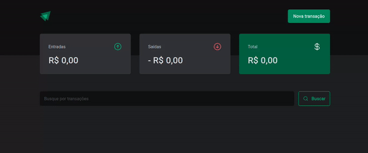

<div align="center" id="top"> 
  

&#xa0;

</div>

<h3 align="center">
    DT Money - Gerenciador Financeiro Pessoal
</h3>

<p align="center">
  <a href="#-projeto">Projeto</a>&nbsp;&nbsp;&nbsp;|&nbsp;&nbsp;&nbsp;
  <a href="#-funcionalidades">Funcionalidades</a>&nbsp;&nbsp;&nbsp;|&nbsp;&nbsp;&nbsp;
  <a href="#-tecnologias">Tecnologias</a>&nbsp;&nbsp;&nbsp;|&nbsp;&nbsp;&nbsp;
  <a href="#-layout">Layout</a>&nbsp;&nbsp;&nbsp;|&nbsp;&nbsp;&nbsp;
  <a href="#licença">Licença</a>
</p>


&#xa0;

## :rocket: Projeto

 <p align="center">
 
 </p>
 
 O projeto DT Money é uma ferramenta de gerenciamento financeiro pessoal que permite ao usuário controlar e organizar suas contas de entrada e saída de forma fácil e intuitiva. A ferramenta utiliza a biblioteca de Fake API -JSON Server para armazenar e fornecer os dados de contas de entrada e saída, permitindo ao usuário ter uma visão geral de suas finanças pessoais e tomar decisões informadas sobre seus gastos e economias.

Além disso, o DT Money possui validação de dados através do uso da biblioteca Zod e utiliza o React Hook Form para gerenciar os formulários do projeto. Isso garante que os dados inseridos pelo usuário sejam precisos e de acordo com as regras de negócio estabelecidas pela ferramenta. 

&#xa0;

## Funcionalidades
- Cadastro de contas de entrada e saída
- Visualização dos totais das contas em cards

&#xa0;

## Conceitos abordados
- Estados
- Componentização
- Imutabilidade do estado
- Propriedades
- Validação

&#xa0;

## 💻 Tecnologias

As seguintes ferramentas foram usadas na construção do projeto:

- [Node.js](https://nodejs.org/en/)
- [React](https://pt-br.reactjs.org/)
- [React Hook Form](https://react-hook-form.com/)
- [TypeScript](https://www.typescriptlang.org/)
- [Axios](https://axios-http.com/)
- [Zod](https://zod.dev/)
- [Radix-UI](https://www.radix-ui.com/)
- [Phosphor](https://phosphoricons.com/)

&#xa0;

## :memo: Pré requisitos

Antes de começar, você precisa ter o [Git](https://git-scm.com) e o [Node](https://nodejs.org/en/) instalados em sua maquina.

&#xa0;

## :wrench: Começando

```bash
# Clone este repositório
$ git clone https://github.com/guiaquinodev/dt-money


# Entre na pasta
$ cd DT-MONEY

# Instale as dependências
$ yarn

# Para iniciar o servidor 
$ yarn dev:server

# Para iniciar o projeto
$ yarn dev

# O app vai inicializar em <http://localhost:3000>
```

&#xa0;

## :thinking: Como contribuir

Se você deseja contribuir com o projeto, basta fazer um fork do repositório, criar uma branch com sua feature, fazer commit das alterações, fazer push para a sua branch e, quando o merge da sua pull request for realizado, deletar a sua branch.

&#xa0;

## 🔖 Layout

Você pode ver o layout do projeto [neste link](https://www.figma.com/community/file/1138814493269096792). É necessário ter uma conta no [Figma](https://figma.com) para acessá-lo.

&#xa0;

## ✔️ Licença

Este projeto está sob licença MIT. Veja o arquivo [LICENSE](LICENSE.md) para mais detalhes.

&#xa0;

<div align="center">
Feito com :heart: por <a href="https://github.com/guiaquinodev" target="_blank">Guilherme Aquino</a>
</div>
